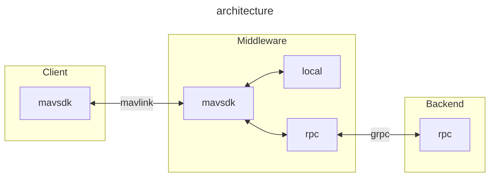

# MAVCam

This repository contains the source code for MAVCam, a camera control system integrated with MAVLink.

## Basic architecture


## Getting Started

These instructions will get you a copy of the project up and running on your local machine for development and testing purposes.

### Prerequisites

*   **clang-format-15**: Required for code formatting.
    ```bash
    sudo apt install clang-format-15
    ```
*   **CMake**: For building the project.
*   **gRPC** and **Protocol Buffers**: For RPC communication.
*   **MAVSDK**: MAVLink SDK for client-side interactions.

### Building

This project uses CMake for its build system.

1.  **Clone the repository**:
    ```bash
    git clone https://github.com/AeroraTech/mav-cam.git
    cd mav-cam
    ```
2.  **Create a build directory and run CMake**:
    ```bash
    mkdir build
    cd build
    cmake ..
    ```
    For specific toolchains, you can specify them during the CMake configuration:
    ```bash
    cmake -DCMAKE_TOOLCHAIN_FILE=../cmake/gcc-linaro-aarch64-linux.toolchain.cmake ..
    ```
3.  **Compile the project**:
    ```bash
    make -j$(nproc)
    ```

## Usage

### Format code

To ensure consistent code style, use the provided `fix_style.sh` script:

```bash
./tools/fix_style.sh ./src
```

### Examples

The `example/` directory contains sample applications demonstrating how to use MAVCam.

*   **Camera Definition Example**:
    ```bash
    ./build/example/camera_definition
    ```
*   **Camera Operation Example**:
    ```bash
    ./build/example/camera_operation
    ```

## Contributing

Please read `CONTRIBUTING.md` (if available) for details on our code of conduct, and the process for submitting pull requests to us.

## License

This project is licensed under the MIT License - see the `LICENSE` file for details.

## Contact

For any questions or support, please open an issue in the GitHub repository.
